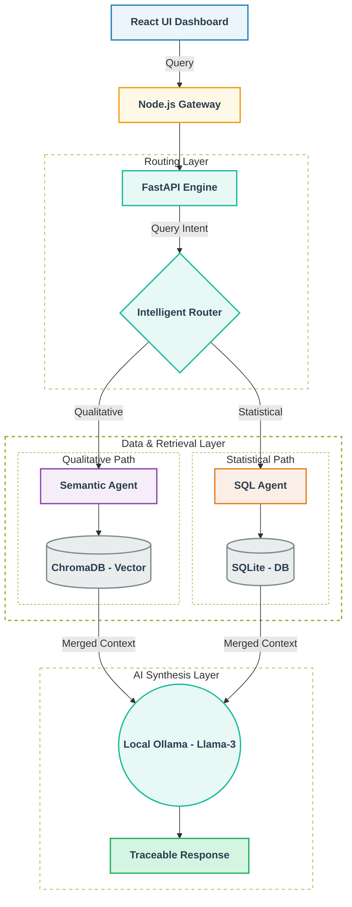

# KOHA-CIL 💻

## Enterprise Intelligence & Reporting Platform

KOHA-CIL is an internal intelligence platform for Coal India Limited and the Ministry of Coal. It combines governed production reporting, document ingestion, conflict quarantine, retrieval-assisted analysis, and a secure role-aware web portal in one operational workflow.

The platform is designed for trusted enterprise reporting: database figures remain the source of truth, uploaded documents are checked before they enter the trusted dataset, and approved conflict resolutions are synchronized back to dashboard reporting.

## What the platform provides

- Executive and subsidiary dashboards for Production (MT), Overburden Removal (OBR), and Dispatch (Rakes).
- 100% Air-Gapped Production Deployment via offline Docker tarballs, strictly avoiding public clouds (AWS/Vercel) to guarantee absolute data sovereignty for CIL.
- Query Console answers grounded in approved production and policy data, with Markdown-aware rendering for tables, lists, headings, and mixed responses.
- Document ingestion for PDF, TXT, CSV, and TSV reports.
- Statistical extraction and normalization for Coal India subsidiaries: ECL, BCCL, CCL, SECL, and MCL.
- Conflict quarantine for mismatched incoming figures, with HQ Admin approval and rejection workflows.
- Automatic dashboard synchronization when an approved production conflict is accepted.
- Government/PSU portal identity with Ministry of Coal and Coal India branding.
- Security gateway with JWT authentication, role-based access control, request validation, rate limiting, and backend protection.
- Local Ollama integration with deterministic fallback behavior when the configured model is unavailable.

## Technical Architecture &amp; Microservices Flow 🏗️

The system is split into distinct functional zones to ensure clear microservice isolation and complete security boundaries.



| Directory | Responsibility | Default port |
| --- | --- | ---: |
| `frontend/` | React dashboard and Query Console | `5173` |
| `security/` | Authentication, JWT, RBAC, validation, and proxy gateway | `3000` |
| `backend/` | FastAPI APIs, database access, ingestion, analytics, and agents | `8000` |

Runtime data is stored under `data/` by default. This includes the SQLite database, uploads, cache, quarantine files, and optional vector-store data.

## Getting Started

### 1. Clone the Repository

Run the following commands to clone the project to your local machine and navigate into the directory:

```bash
git clone https://github.com/sahilvish01/KOHA-CIL.git
cd KOHA-CIL
```

### 2. Prerequisites & Environment Setup

- Ensure **Node.js**, **Python 3.10+**, and **Docker** are installed on your system.
- Ensure **Ollama** is installed locally with the `llama3` model pulled.
- Copy the sample environment file and configure your local variables:

  ```bash
  cp .env.example .env
  ```

## Project scripts

The `scripts/` directory contains helper files strictly for local development and testing:

- `start-dev.bat` & `reset-dev.bat`: For Windows machines.
- `start-dev.sh`: For Linux/macOS machines.
- `health-check.js`: For backend API health monitoring.

## Local development

### Backend

```powershell
cd backend
..\.venv\Scripts\Activate.ps1
pip install -r requirements.txt
python -m uvicorn main:app --reload --host 0.0.0.0 --port 8000
```

The backend seeds the local SQLite database during startup. Its default database path is `../data/koha_cil.db` when started from `backend/`.

### Security gateway

In a second terminal:

```powershell
cd security
npm install
npm run dev
```

The gateway listens on port `3000` and proxies authorized requests to the backend.

### Frontend

In a third terminal:

```powershell
cd frontend
npm install
npm run dev
```

The Vite development server listens on port `5173`.

For a production frontend build:

```powershell
npm run build
npm run preview
```

## Quick start with Docker Compose

1. Copy the environment template and update production secrets:

   ```powershell
   Copy-Item .env.example .env
   ```

2. Start the platform:

   ```powershell
   docker compose up --build
   ```

3. Open the portal at [http://localhost:5173](http://localhost:5173).

The gateway is available at [http://localhost:3000](http://localhost:3000), and the backend health endpoint is available at [http://localhost:8000/health](http://localhost:8000/health).

To stop the stack:

```powershell
docker compose down
```

The `data/` directory is mounted into the backend container so database and ingestion data persist across container restarts.


## Configuration

Copy `.env.example` to `.env` and change secrets before using the platform outside local development.

| Variable | Default | Purpose |
| --- | --- | --- |
| `FRONTEND_PORT` | `5173` | Frontend port |
| `GATEWAY_PORT` | `3000` | Security gateway port |
| `BACKEND_PORT` | `8000` | FastAPI port |
| `BACKEND_URL` | `http://localhost:8000` | Gateway-to-backend URL |
| `FRONTEND_ORIGIN` | `http://localhost:5173` | Allowed browser origin |
| `OLLAMA_URL` | `http://localhost:11434` | Ollama service URL |
| `OLLAMA_MODEL` | `llama3` | Ollama model name |
| `JWT_SECRET` | development placeholder | JWT signing secret; replace it |
| `JWT_EXPIRES_IN` | `8h` | JWT lifetime |
| `INTERNAL_SECRET` | development placeholder | Gateway/backend shared secret; replace it |
| `DATABASE_PATH` | `../data/koha_cil.db` | SQLite database path |
| `UPLOAD_DIR` | `../data/uploads` | Uploaded source documents |
| `QUARANTINE_DIR` | `../data/quarantine` | Quarantined source files |
| `CACHE_DIR` | `../data/cache` | Extracted document cache |
| `CHROMA_PERSIST_DIR` | `../data/chroma` | Optional vector-store persistence |

## Authentication and roles

The gateway issues JWTs after credential verification and applies permissions before forwarding requests. The backend repeats sensitive authorization checks at its own boundary.

Seeded development accounts use the password `demo123`:

| Account | Role | Scope |
| --- | --- | --- |
| `hq.admin` | HQ Officer | Enterprise dashboard, ingestion, conflict review, and audit access |
| `ccl.officer` | Subsidiary Officer | CCL-scoped operational access |
| `secl.officer` | Subsidiary Officer | SECL-scoped operational access |
| `ecl.officer` | Subsidiary Officer | ECL-scoped operational access |
| `mcl.officer` | Subsidiary Officer | MCL-scoped operational access |

These credentials are for local development only. Change or remove them before any deployment.

## Document ingestion and conflict quarantine

```text
Upload document
  → extract PDF/text content
  → normalize subsidiary, financial year, mine type, and figures
  → compare against trusted production_statistics
  → insert matching records or create PENDING_REVIEW quarantine records
  → HQ Admin approves or rejects
  → approval synchronizes production_mt and achievement_percentage
```

A simple CSV conflict test can be created with this content:

```csv
Subsidiary,Financial Year,Mine Type,Production (MT),Target (MT)
CCL,FY2023-24,TOTAL,99.9,69.0
```

Upload it from **Ingestion** as `hq.admin`. Because the seeded trusted CCL total is `65.9 MT`, the upload should appear in **Conflicts** with status `PENDING_REVIEW`. Approving it updates the trusted production figure and dashboard calculations; rejecting it changes only the conflict status.

PDF reports may use normal text lines, CSV-like rows, or table cells split across lines. Text-layer PDFs are extracted directly. Image-only PDFs require optional OCR tooling.

## Query Console

The Query Console features an Intelligent Router that strictly separates data concerns. Statistical queries bypass the LLM entirely and are routed to a deterministic SQL Agent, guaranteeing zero math hallucinations. Qualitative policy questions are directed to a Semantic Agent (ChromaDB + Local Llama-3) for grounded natural-language synthesis. Responses are rendered as safe GitHub-Flavored Markdown, including tables, aligned numeric columns, headings, and citations.

Ollama is optional for local startup: the backend falls back to deterministic responses when the configured service or model cannot be reached.

## Operational endpoints

| Endpoint | Service | Purpose |
| --- | --- | --- |
| `GET /health` | Backend or gateway | Service health check |
| `POST /api/auth/login` | Gateway | Authenticate and issue a JWT |
| `POST /api/query` | Gateway | Submit a governed Query Console request |
| `POST /api/ingest` | Gateway | Upload a report for ingestion |
| `GET /api/conflicts` | Gateway | List quarantine records |
| `POST /api/conflicts/:id/review` | Gateway | Approve or reject a conflict |
| `GET /api/ingestion/jobs` | Gateway | Inspect ingestion job status |

The backend’s internal routes are protected by the shared gateway secret and are not intended for direct browser access.

## Security notes

- Never use the example JWT or internal secrets in production.
- Keep the backend internal to the gateway network where possible.
- Treat uploaded documents and LLM output as untrusted input.
- Preserve the quarantine workflow; do not bypass conflict review by writing directly to trusted production tables.
- Restrict the `data/` directory and database backups to authorized operators.
- Configure HTTPS, secret management, log retention, and backup policies before deployment.

## Troubleshooting

**The frontend cannot reach the API**

Confirm that the gateway is running on port `3000`, the backend is healthy on port `8000`, and `FRONTEND_ORIGIN` matches the browser origin.

**The backend cannot start**

Start it from `backend/`, activate the project virtual environment, install `requirements.txt`, and verify that the configured `DATABASE_PATH` is writable.

**The Query Console uses fallback answers**

Check that Ollama is running at `OLLAMA_URL` and that the model named by `OLLAMA_MODEL` is available locally.

**An upload produces no conflict**

Confirm that the file contains a supported subsidiary, a financial year such as `FY2023-24`, a recognized mine type, and a numeric production value. Then review the ingestion job status and backend logs.

## License and ownership

This repository is maintained as an internal Coal India / Ministry of Coal project artifact. Add the organization-approved license, ownership, and contribution policy before external distribution.

---
Maintained and deployed by **Team ALT Z** to empower Coal India Limited and the Ministry of Coal with verifiable, offline AI intelligence